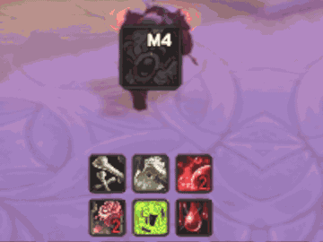

# Button Assistant Enchanced

<!-- Demo GIF placeholder: replace this line with a gameplay loop when ready. -->


**Button Assistant Enchanced** is a polished visual companion for Blizzard's Assisted Combat feature in modern World of Warcraft Retail. It gives the default recommendation system the kind of readable, responsive, and customizable feedback that makes relaxed gameplay feel smooth instead of vague.

It is built for players who want to lean back, enjoy the fight, maybe embrace a little beer-friendly gameplay, and still understand exactly what the assistant is suggesting, what is on cooldown, and when a proc deserves attention.

## Highlights

- A clean recommendation button for Blizzard Assisted Combat.
- Combat-safe cooldown sweep and countdown handling for GCD and real spell cooldowns.
- Optional keybind display pulled from your action bars.
- Proc feedback with Blizzard-style glow, a minimal focus glow, or a custom sweep-line glow.
- Ready and cooldown-finished feedback through short flash, pulse, and bounce effects.
- Range and usability tinting for quick at-a-glance decisions.
- Avada Tracker icons for compact cooldown awareness below the main button.
- In-game settings organized by layout, cooldowns, feedback, effects, logic, and tracker controls.

## Why It Exists

Blizzard's Assisted Combat is useful, but its presentation can feel too quiet for repeated moment-to-moment play. Button Assistant Enchanced keeps the assistant simple while adding stronger visual rhythm: a clear suggested spell, readable cooldown state, tasteful effects, and enough configuration to make it fit your UI.

The goal is not to turn combat into a dashboard. The goal is to make the assistant feel like it belongs in a modern UI.

## Installation

1. Download or clone this repository.
2. Place the `ButtonAssistantEnchanced` folder into:

   ```text
   World of Warcraft/_retail_/Interface/AddOns/
   ```

3. Restart the game or run `/reload`.
4. Enable **Button Assistant Enchanced** in the AddOns list.

## Commands

```text
/buttonassistantenchanced
/bae
/baenchanced
```

Open the addon settings.

```text
/bae toggle
```

Toggle the assistant on or off.

```text
/bae logs
```

Show recent caught addon errors, if any.

```text
/baeavada
```

Open Avada Tracker configuration.

## Configuration

The settings panel is split into focused sections:

- **Main Button**: size, scale, and border.
- **Visibility**: combat and out-of-combat opacity, combat-only display, vehicle hiding.
- **Keybind Text**: keybind visibility and font size.
- **Cooldowns & Feedback**: cooldown visuals, countdown text, GCD behavior, range and usability tinting.
- **Effects - General**: shared effect behavior.
- **Effects - Next Ready**: feedback when the recommendation changes to a ready spell.
- **Effects - Cooldown Ready**: feedback when the current recommendation becomes ready.
- **Effects - Proc Highlight**: persistent proc glow style and proc-start feedback.
- **Recommendation Logic**: action-bar visibility filtering.
- **Avada Tracker**: compact tracker layout and display controls.

## Notes

Button Assistant Enchanced is designed for Retail Assisted Combat and current Retail UI APIs. Classic clients and private/emulated environments are not expected to provide the same behavior.
