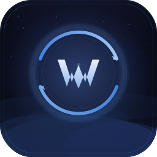

# Button Assistant Enchanced

<p align="center">
  
</p>

<p align="center">
  
</p>

Hey there! 🍻

**Button Assistant Enchanced** is a standalone, lightweight WoW Retail addon built to upgrade Blizzard’s default Assisted Combat feature. If you've ever tried using the default assistant and found it a bit too quiet, vague, or just plain boring to look at during a chaotic fight, this addon is here to save the day.

It transforms the recommended ability into a clean, highly configurable button that sits exactly where you want it. Whether you are running high keys or just chilling with a cold beer in one hand and your mouse in the other, this addon makes sure you always know what to press next without staring at your action bars.

## What It Does (Without the Boring Stuff)

We kept it clean and pretty, not like a cockpit dashboard:

- **Clear Recommendations:** The next recommended ability is displayed right in your face as a neat, customizable button.
- **Readable Cooldowns:** Smooth, combat-safe cooldown sweeps and countdowns (including Global Cooldowns) so you aren't guessing when a spell is ready.
- **Keybind Display:** Directly pulls and shows the keybinds from your action bars. No memory tests required.
- **Visual Juice:** Juicy proc highlights (standard glow, focus glow, or custom line sweep), plus subtle button bounce/pulse animations when a big cooldown becomes ready.
- **Range & Usability Checks:** The button tints itself when you're out of range or lacking resources, saving you from useless key-mashing.
- **Avada Trackers:** Compact secondary tracker icons below the main button to keep an eye on extra cooldowns.
- **Cozy In-Game Settings:** Easy config panel to tweak layouts, scales, colors, and effects to match your UI.

## Why It Exists

Blizzard's Assisted Combat is a nice idea, but its presentation is just too easy to miss. Button Assistant Enchanced adds the missing rhythm. It doesn't play the game for you, but it sure makes casual grinding, leveling, and relaxing combat feel smooth, responsive, and nice to look at. Perfect for those laid-back evening gaming sessions.

## Installation

1. Download or clone this repository.
2. Put the `ButtonAssistantEnchanced` folder into your WoW addons folder:
   ```text
   World of Warcraft/_retail_/Interface/AddOns/
   ```
3. Restart the game or type `/reload` in the chat.
4. Enable it in your AddOns list and grab a drink.

## Quick Commands

Type any of these to open the settings panel:
```text
/bae
/baenchanced
/buttonassistantenchanced
```

Toggle the assistant on/off on the fly:
```text
/bae toggle
```

Open Avada Tracker settings:
```text
/baeavada
```

See if anything broke behind the scenes:
```text
/bae logs
```

## Settings Overview

The options panel is split into neat tabs so you don't get lost:
* **Main Button & Visibility:** Tweak the scale, borders, and set it to hide out of combat or while driving vehicles.
* **Cooldowns & Keybinds:** Set up font sizes, range tint colors, and GCD behaviors.
* **Effects & Procs:** Turn on/off the subtle bounce animations, customize your proc glow, and make the button flash when something is ready.
* **Logic & Trackers:** Filter action-bar visibility and configure the compact Avada Trackers.

## A Quick Note

This addon is tailored specifically for Retail's Assisted Combat and the modern Retail UI APIs. Classic clients or emulated servers won't have the required engine features, so keep it Retail-only!

Cheers! 🍺
